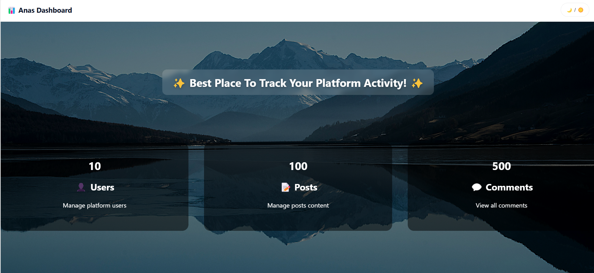

# 📊 Dashboard Project

A mini dashboard built with **HTML, CSS, JS, jQuery, DataTables, Animate.css, Toastr, and JSONPlaceholder API**.  
Features simulate a small freelance-style project.

---

## 🚀 Features
- Dashboard stats (Users, Posts, Comments)
- Users page with DataTables:
  - View / Edit / Delete
  - Favorite ⭐ (saved in LocalStorage)
- Posts page:
  - Live search
  - Add / Edit / Delete (local changes)
  - Show comments from API
- Toastr notifications for actions
- Loader animation
- Light/Dark mode toggle

---

## 📦 Libraries Used
- [jQuery](https://jquery.com/)
- [DataTables](https://datatables.net/)
- [Animate.css](https://animate.style/)
- [Toastr](https://codeseven.github.io/toastr/)
- [JSONPlaceholder API](https://jsonplaceholder.typicode.com/)

---

## ▶️ How to Run
1. Clone or download the project.
2. Open `index.html` in your browser.
3. Navigate between **Dashboard**, **Users**, and **Posts** pages.

---
